# Architecture

`omp-ov-memory` is an OMP/Pi extension with an agent-neutral OpenViking core. It integrates through hooks, eleven tools, and `/ov` (`/viking` alias). It does not register an unsupported value in OMP's native `memory.backend` setting.

## Modules and boundaries

| Module | Responsibility |
| --- | --- |
| `extensions/openviking.ts` | OMP lifecycle, per-session runtime, context injection, commands and URI interception |
| `src/config.ts`, `src/client.ts`, `src/security.ts` | Configuration/credential precedence, HTTP transport, timeouts, namespace and resource-fetch protections |
| `src/workspace.ts` | `.ov-memory.toml`, repository/worktree routing, workspace peer and session namespace |
| `src/capture-policy.ts` | Built-in secret exclusions, configured allow/deny paths, correlated tool-call/result exclusions |
| `src/hook-queue.ts` | Private durable spool, asynchronous dispatch, replay and bounded shutdown |
| `src/sync.ts`, `src/shared/recorded-event*.mjs` | Filtered session projection, deterministic RecordedEvents, workspace-qualified native IDs and ancestry-aware ACK |
| `src/session-mirror.ts` | Native text-message reconciliation, durable append intents and guarded commit watermarks |
| `src/shared/archive*.mjs` | Deterministic archive boundaries, manifest verification and archive expansion |
| `src/shared/checkpoint*.mjs`, `src/shared/active-context.mjs` | Background checkpoint facts and optional context takeover |
| `src/recall.ts`, `src/shared/recall-core.mjs` | Query scheduling, search, result assembly and token budgets |
| `src/ledger.ts` | First block per historical user turn, stored and reapplied byte-for-byte |
| `src/handoff.ts` | Workspace handoff in the shared base-user namespace |
| `src/tools.ts` | Eleven explicit `viking_*` tools, shared with the MCP fallback |
| `servers/mcp-proxy.mjs` | JSON-RPC MCP stdio server exposing the tool layer |

The MCP proxy exposes tools. Session hooks, automatic recall injection, native compaction handling and automatic handoffs require the extension.

## Capture and synchronization

```mermaid
flowchart LR
    OMP[OMP session and hooks] --> Policy[Capture policy]
    Policy --> Spool[Private pending spool]
    Spool --> Queue[Serialized asynchronous handler]
    Queue --> Source[Filtered session source]
    Source --> Events[Deterministic RecordedEvents]
    Events --> OV[OpenViking content objects]
    OV --> Proof[Byte verification]
    Proof --> ACK[Local ancestry ACK]
    ACK --> Mirror[Guarded native message mirror]
    Mirror --> Native[Native session context and commit]
    ACK --> Archives[Verified archive manifests]
    Archives --> Checkpoints[Checkpoint facts]
    Checkpoints --> Takeover[Optional context takeover]
```

Capture policy runs before a hook payload is persisted, again when durable jobs are replayed, and before the sync engine projects either JSONL or in-memory session entries. Excluded entries retain only a structural `capture_excluded` marker with identity, parent and timestamp. That preserves the session graph without retaining the excluded content. Filter errors fail closed.

The plugin's policy controls its own capture. It does not change OMP's source transcript or erase data previously stored in OpenViking. Secret detection is a bounded heuristic; a deliberate allowlist is appropriate when the permissible source files are known.

The engine synchronizes the session entry tree, including separate branches. Archive creation uses the acknowledged prefix of the selected branch. This distinction prevents an abandoned sibling branch from becoming part of the selected context archive. Local ACK files record acknowledged leaves, from which ancestor coverage can be recomputed.

Projection and storage identities remain compatible with the Apache-licensed engine's recorded-event format. Some remote paths and hash-domain strings retain the upstream `.pi-openviking` name. Native OpenViking session IDs use the `ov-` harness prefix with a suffix derived from the workspace namespace. Reusing a native harness session ID in another workspace therefore does not select the same server session. The remote native session and the content-object event namespace serve different purposes.

## Queue and lifecycle

The default dispatch window is 100 records, flush interval 2 seconds, flush threshold 20, and handler timeout 2 seconds. `session-start`, `stop`, `session-end` and `pre-compact` trigger immediate asynchronous dispatch. Overflow is persisted to disk; it is not removed from the oldest end of a memory array.

`enqueue` performs capture filtering and JSON serialization synchronously, then starts asynchronous local persistence. It never awaits OpenViking. Pending files are private, fsynced and atomically renamed before dispatch. A process lease serializes consumers of the same spool. Failed delivery retains the record and stops that ordered pass; the next flush or startup retries it.

The extension uses a queue identity derived from the configured endpoint/account/user, a credential fingerprint and workspace, so a later session can discover older jobs. It stores neither the token nor an unfiltered payload as identity metadata; rotating the credential selects a different spool. Each payload retains its source session identity. Old-session replay uses the corresponding namespace and a separate engine instead of writing it into the new session.

A timed-out handler receives an abort signal. The queue keeps an unfinished handler and its lease until it settles, preventing an immediate overlapping retry. The sync engine checks that signal between entry writes. A late confirmed success may still acknowledge the record. Shutdown bounds the time the extension waits; it cannot make an uncertain remote write disappear.

A sync queue job first verifies immutable raw-event delivery, then attempts its guarded native text mirror. The record is removed only when both succeed. If the mirror has an unknown outcome, the ordered queue retains that job and later jobs; raw objects already verified remain valid. Native extraction/commit is requested separately after the queue drains. Its result must not be inferred from successful raw-event synchronization or a green health response.

## Native session mirror

OpenViking preserves `source_message_ids` but does not make message append idempotent. `SessionMirror` derives a stable source ID and role/content digest for approved user, assistant and tool-result text. It writes a private create-only intent before append, then publishes an acknowledgment only after matching positive remote readback. Its local records contain identities, digests and server-session creation timestamps, not captured message text.

Inspection reads current context and, when needed, canonical raw message JSONL and archive history. Incomplete, truncated, changing or contradictory remote evidence fails closed. A different server-session creation timestamp means the session was replaced; a duplicate source ID with contradictory proof also stops delivery. Existing append intents are never resent merely because the message is absent. A later positive readback can resolve them.

Commit is also guarded by a durable create-only intent keyed to the set of confirmed source IDs and content digests. The mirror submits at most one commit attempt for that watermark. An explicit accepted/skipped response acknowledges the request; after uncertainty, an advanced commit counter on the same server-session generation can reconcile it. An unchanged counter leaves `commitUnknown` set. Commit acceptance and completed model extraction remain different states.

The status fields `confirmed`, `unknown`, `commitUnknown`, and `lastError` describe the mirror's latest loaded or reconciled metadata. Local state lives under `<stateDir>/session-mirror/<identity-hash>/`. Native history is an append-only text mirror of branches captured over time; switching a branch does not erase messages already mirrored. It is distinct from the archive engine's exact active-branch reconstruction.

## Archives and checkpoints

Events have deterministic identities and canonical bytes. Direct objects and chunked representations are checked for consistency. A chunked event is accepted only with its verified commit marker. Archive manifests identify a contiguous event range, bind its content hash, and are verified with their referenced event data.

An archive is an application-level verified object. A batch HTTP request is not a database transaction, and a successful HTTP response is not enough to acknowledge partial or different stored bytes. On the deployed v0.4.20 API, the adapter reconciles already existing identical bytes and uses native `mode: "create"` for missing immutable objects, followed by byte reads.

The API does not expose atomic compare-and-swap by hash. Requests for the upstream `replace_if_hash` precondition fail closed with status `501` / `UNSUPPORTED_PRECONDITION`. Consequently, repair of a partial/corrupt object requiring that replacement cannot be completed automatically on this server. The plugin does not silently convert that request into an unconditional overwrite.

Checkpoint work is derived from verified archives and runs in the background. The processor uses `SessionMirror` for its task input and commit, so polling or restarting cannot blindly repeat a non-idempotent submission. It discovers provider tasks after guarded commit acceptance and verifies the resulting checkpoint separately. Its state is separate from event delivery ACK. Checkpoint or takeover failure preserves the ordinary agent context. Takeover is disabled by default and requires the appropriate checkpoint/context facts before replacing context. Live raw-sync or health checks do not validate paid VLM generation.

## Recall, ledger and handoff

Session startup can restore native context text from the server's messages, text parts and completed archive overview, within the resume budget. Missing or incomplete server summaries are not synthesized as successful extraction. Native base-user extracted memories remain excluded from strict session-scoped URI recall; scoped explicit notes and the shared workspace handoff provide their respective retrieval paths.

`before_agent_start` records the next recall query without network I/O. The `context` hook performs bounded recall assembly. The ledger records the emitted block against a stable historical user-turn key and reuses those exact bytes on later turns. It avoids regenerating historical blocks merely because retrieval rankings have changed. It is not a claim about provider-side cache hit rates.

Handoffs live at `viking://user/<base-user>/omp-ov-memory/handoffs/<workspace-scope>/latest.json`, independently of session-scoped memory. They carry source agent/session, timestamp and workspace scope. A later session treats their text as historical data. Handoffs are best effort and last-writer-wins; they are neither a worktree lock nor a distributed task-ownership protocol.

Workspace routing resolves once per session. A `.ov-memory.toml` marker may name a project and workspace; explicit shared project names intentionally permit sharing across clones. Repository identity otherwise separates projects, with worktrees resolving to their common repository. Authentication/tenant isolation still depends on server credentials and permissions, not merely on peer labels or URI conventions.

## Provenance

The RecordedEvent/archive/checkpoint/recall engine is adapted from Apache-2.0 `pi-openviking@0.4.4`; notices are retained in the repository. Queue, handoff, routing and capture-policy designs use the public MIT reference as design input. The additional tools, MCP adapter and ledger are clean implementations. No AGPL implementation code is included.
